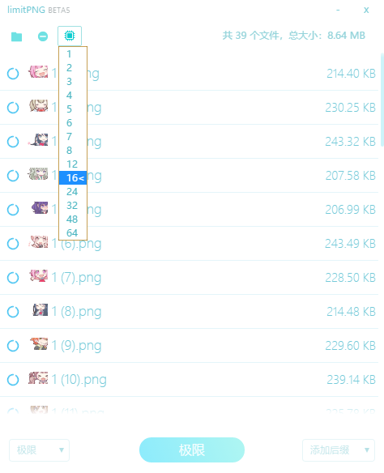

# limitPNG2 Image Compression

While batch-compressing my PNG images today, I found limitPNG2 a bit slow and decided to try gluttonyPNG. Unfortunately, several images were simply gone after compression — since the tool overwrites in place, it deleted my original files directly.

So I went back to check limitPNG2's forks. The only recent one was a threading optimization by 琴梨梨, but I couldn't get it to work after packaging. I ended up reworking the threading myself — now supporting up to 64 threads — and also fixed some multi-threading stuttering issues.

Published at [XTsat/limitPNG](https://github.com/XTsat/limitPNG)

