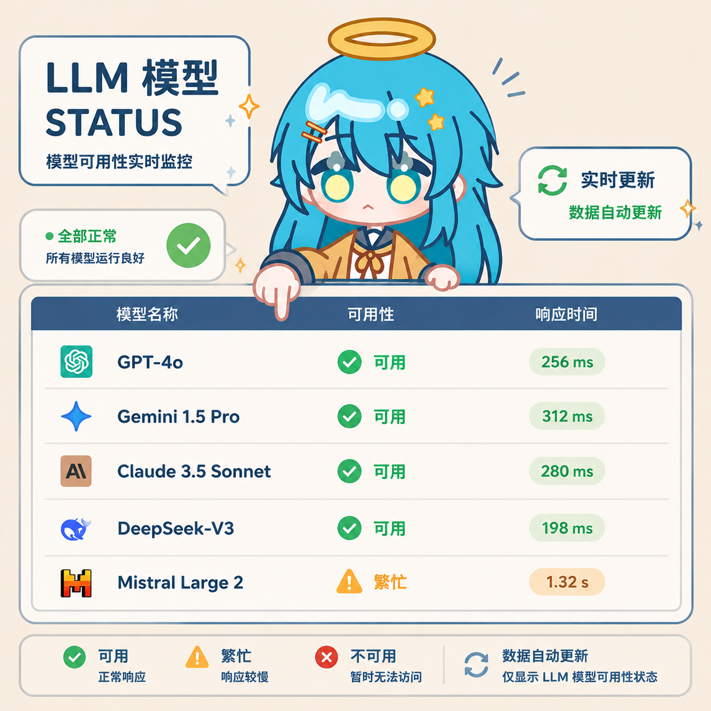

# AstrBot 插件

我最近经常遇到插件过老无法使用或是没有相关插件的情况，于是我自己开发了几个我觉得有需求的插件。

## [MsgForward —— 跨平台消息转发插件](../guide/astrbot/MsgForward.md)（2026-06-17）

[astrbot_plugin_msg_forward_cc](https://github.com/XTsat/astrbot_plugin_msg_forward_cc)

跨平台消息转发插件，支持在不同聊天平台之间同步消息、桥接群聊，支持多平台互通、消息来源标注、WebUI配置和消息过滤。

## [MemeGrabber —— 表情包提取插件](../guide/astrbot/MemeGrabber.md)（2026-06-30）

[astrbot_plugin_meme_grabber](https://github.com/XTsat/astrbot_plugin_meme_grabber)

表情包提取插件，用于将 QQ 表情包提取为可保存的文件格式，支持多种格式、批量提取和自定义命名。

## [LLM Balance —— 多平台余额查询插件](../guide/astrbot/LLMBalance.md)（2026-07-03）

[astrbot_plugin_llm_balance](https://github.com/XTsat/astrbot_plugin_llm_balance)

多平台 LLM 余额查询插件，支持查询 DeepSeek、硅基流动、Moonshot、OpenAI 等平台的余额/用量。

## [ModelStatus —— 模型状态查询插件](../guide/astrbot/ModelStatus.md)（2026-08-06）

[astrbot_plugin_model_status](https://github.com/XTsat/astrbot_plugin_model_status)

在 AstrBot WebUI 中检测所有已配置模型提供器的可用性。

